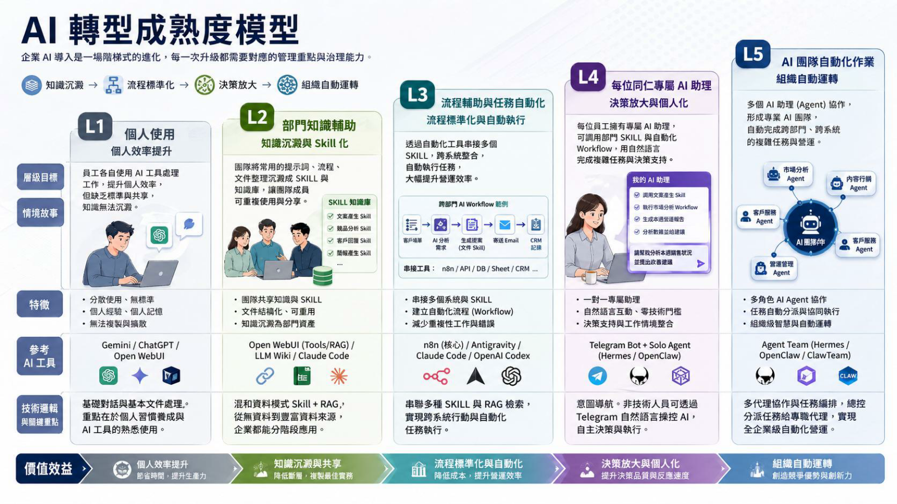

# GenAI Consulting Methodology Toolkit

Language: [繁體中文](README.md) | English | [ภาษาไทย](README_TH.md) | [Deutsch](README_DE.md) | [Français](README_FR.md) | [Español](README_ES.md) | [日本語](README_JA.md) | [한국어](README_KR.md)

Enterprise AI transformation maturity assessment and implementation methodology toolkit.

Original Author: **Tiger AI Morris Lu 盧業興**  
Role: **n8n Taipei Ambassador / PhD Student, Graduate Institute of Intelligent Manufacturing, National Taiwan University of Science and Technology / M.IT, Queensland University of Technology (QUT), Australia**

License summary: this project is released under the **[Apache License 2.0](LICENSE)**. You may freely use, copy, modify, redistribute, and commercialize it; when redistributing, preserve the Apache 2.0 license text and the attribution notices in [`NOTICE`](NOTICE).

> **Only have 5 minutes?** Read [`00_Overview/EXECUTIVE_SUMMARY_EN.md`](00_Overview/EXECUTIVE_SUMMARY_EN.md) first — the whole methodology on one page.

---

## 🌟 This Isn't Just a Book — It's an AI-Native Living Book ── A Book That Is Truly *Alive*

Books have evolved generation by generation. Each generation solved one problem, but left behind one gap — **none of them were ever truly *alive***:

- **Gen 1 — Printed books**: preserve knowledge and pass it to the next reader. But they can **only be read — they don't respond**; they cannot answer your questions, and they don't know what your company looks like. They are **paper that sits still**.
- **Gen 2 — Interactive books**: once moved onto the web and into wikis, they can be searched, hyperlinked, and commented on. They added **interaction** on top of printed books, but they still **don't proactively suggest** anything to you, let alone analyze your situation or produce new artifacts — still passive: the *interface* came alive, but the *content* didn't.
- **Gen 3 — AI-Native Books (this repo) — a book that is truly alive**: the methodology body is written in Markdown and opened in an AI IDE — the AI auto-reads the entire book, **lets you ask, answers for you, thinks with you**, and **gives customized recommendations, runs diagnostics, drafts reports, and runs simulation exercises based on your company's actual situation**. The book itself responds, extends, and grows new chapters along with your questions.

In other words: printed books transmit knowledge, interactive books make it searchable, and **AI-Native Books — for the first time — make "the book" truly come alive, becoming a partner that thinks alongside you**. The final decision still rests with humans, but you are no longer alone facing a static methodology.

> *Three generations of books: printed (read-only, dead) → interactive (search & link, still passive) → **AI-native (truly alive — advises, analyzes, simulates, and grows with your questions)**. Open with an AI IDE; AI becomes your reading partner, consulting assistant, and auditor.*

### 🔱 Three AI Engines, Each Specializing in Different Things

The same content takes on **completely different personalities** depending on which AI IDE you choose:

| Engine | Role | What it's best at |
| --- | --- | --- |
| 🟦 **Antigravity** | Front-line consultant | Talking with clients, running questionnaires, drafting reports |
| 🟪 **Codex CLI** | Methodology auditor | Cross-file testing, red-team review, version control, repairing broken links |
| 🟨 **Claude Code** | Cross-file thinking partner | Deep synthesis, multi-perspective debate, simulation exercises, client forks |

The three engines don't replace each other — they **divide labor**: use Antigravity in the morning to meet with clients, use Codex in the afternoon to audit the report draft, use Claude Code in the evening to run scenario simulations. Each engine has its own workspace (`.agent/` / `.codex/` / `.claude/`) that does not interfere with the others.

Each engine's detailed self-disclosure is in [`07_AI_Contributions/`](07_AI_Contributions/); installation steps are in the [Three AI Engines Setup Guide](#-three-ai-engines-setup-guide--三-ai-引擎安裝與啟動指南) below.

### What This Means for Different Readers

- **CEO / Executives**: drop this repo into ChatGPT / Claude / Gemini, and a 10-minute Q&A gives you a preliminary read on "what level is my company at? what should we do first?"
- **Consultants / Trainees**: open it in an AI IDE and run the full conversational consulting experience — from diagnosis to report to a 24-month implementation roadmap.
- **Academics / Researchers**: directly run `/devil-pair-debate` and `/thought-experiment` to debate the methodology's value-laden assumptions, backed by 7 theoretical pillars and 28 classic citations.
- **Regulators / Compliance**: run `/evidence-audit` and `/generate-traceability` to obtain auditable evidence chains aligned with NIST AI RMF / EU AI Act / ISO 42001.

> ⚠️ **Honest disclosure**: The methodology's overall architecture was designed by **Morris Lu (human)**; the three AI engines are merely tools that execute, complete, and audit. See [`07_AI_Contributions/README.md`](07_AI_Contributions/README.md) §0. All cases in this book are AI-simulated for teaching purposes — **not real client data**.

---

## What This Toolkit Solves

Many companies start AI adoption by jumping straight into tools — buy ChatGPT today, try n8n tomorrow, then think about Agents next week. The recurring problems are: employees don't know how to use it, processes don't connect, data isn't governed, PoCs can't be accepted, and executives ultimately don't know which level of AI maturity the company has actually reached.

This toolkit's strategy: first use a lightweight questionnaire to diagnose the company's current AI maturity, then design course ratios and adoption paths according to L1-L5. Courses don't end when the class finishes — every level leaves verifiable deliverables behind. Finally, an eight-stage AI transformation consulting method produces a complete diagnostic report, roadmap, ROI view, and governance recommendations.

## Future-State Story Before Class

Before clients decide whether to take the L1-L5 course, what they need most is to first see a picture of the future: not "we'll learn five tools," but "**after the company finishes the course, how will daily work change?**"

The story line: **scale expands one layer at a time, and eventually grows from "humans use AI" into "AI works on its own"** — **individual → department → cross-department / company-wide → AI super-assistant (entity) → AI team**. Imagine three months from now, on a Monday morning:

- **L1 Controlled AI Access — Scale axis · individual**: **each employee, on their own**, logs into OpenWebUI with their own account, chat workspace, history, and departmental permissions. Sales writes client emails, HR organizes training summaries, managers produce meeting highlights — all from a single controlled AI entry point. **The unit is "the individual"** — AI sits next to each person.
- **L2 Knowledge Codification — Scale axis · department**: **the unit upgrades to "the department."** Senior staff are no longer just individually good at what they do — bounded by **departmental responsibility**, they package copywriting, reports, customer service responses, SOP interpretations, and development methods into reusable Skills. New hires and others in the same department reuse the same methods, and **the department as a whole** starts producing consistent output quality.
- **L3 Workflow Automation — Scale axis · cross-department / company-wide**: **the unit upgrades again to "cross-department, company-wide."** n8n connects each department's Skills with company systems (Gmail, Sheets, Notion, CRM, APIs, ERP). One incoming customer complaint can **traverse Sales, Customer Service, CRM, and managers across multiple departments** automatically — the system queries CRM, updates forms, creates tasks, and produces a manager summary; humans handle only judgment and approval. AI now enters **company-wide processes**.
- **L4 Autonomous Agent — AI-autonomy axis · super-assistant (AI entity)**: **on top of the human workforce, the company grows an additional AI entity.** Hermes Agent reads tasks, documents, workflow results, and Wiki memory daily, producing briefings, follow-up lists, and decision points needing HITL (Human-in-the-Loop) review. The company starts to own a **verifiable knowledge-grade AI entity** — like hiring an extra fully-autonomous super-assistant.
- **L5 Multi-Agent Organization — AI-autonomy axis · AI team**: **multiple L4 entities are organized into an "AI team."** ClawTeam composes specialist Agents — market, product, customer service, finance, operations — into a functional division of labor, collaboratively handling new product launches, quality improvement, patient service improvement, or customer-relationship work. The company now runs **two workforces side by side: a human team and an AI team**.

This story should be told before the course begins. Once the client understands "**how scale expands layer by layer, and how AI grows from a tool into digital workforce**", they can return to understand why a diagnostic questionnaire is needed, why the course is split L1-L5, and why every layer must have deliverables, evidence, and Stage-Gate acceptance.

> ⚠️ For a deeper explanation of the two axes (why L3 → L4 is the critical boundary, why governance always stays in human hands), see [§The Two Axes of L1-L5](#the-two-axes-of-l1-l5) below.

## AI Maturity Map



## Methodology Overview


## Core Story Line

```text
AI maturity questionnaire
→ Company profile, industry scenario, and deployment-mode survey
→ L1-L5 course mix design
→ L1 OpenWebUI enterprise accounts and personal chat workspaces
→ L2 Antigravity / Claude Code / Codex Skill training
→ L3 n8n workflows connected to Gmail, Sheets, Notion, CRM, API, ERP
→ L4 Hermes Agent for verifiable autonomous agentic work
→ L5 ClawTeam for Agentic Team collaboration
→ Scenario cases, evidence, and acceptance gates (Stage Gates)
→ Eight-stage AI transformation consulting diagnosis
→ AI transformation diagnostic report, roadmap, ROI, and governance recommendations
```

## L1-L5 Maturity Model

| Level | Name | Tool / Platform | Axis | Enterprise Positioning |
| --- | --- | --- | --- | --- |
| L1 | Controlled AI Access | OpenWebUI | Scale axis · individual | Establish the enterprise's internal AI chat entry point — every employee has their own account, AI chat workspace, and permission boundary |
| L2 | Knowledge Codification | Antigravity / Claude Code / Codex | Scale axis · department | By department responsibility, package personal knowledge, prompts, documents, and work methods into reusable Skills |
| L3 | Workflow Automation | n8n | Scale axis · cross-department / company-wide | Connect cross-department Skills with email, Sheets, Notes, CRM, API, ERP, and other systems, so AI enters company-wide automation processes |
| L4 | Autonomous Agent | Hermes Agent | AI-autonomy axis · super-assistant | Combine Wiki capability map, AI tools, Workflows, auto-scheduling, and autonomous learning into a verifiable, fully autonomous AI Agent super-assistant |
| L5 | Multi-Agent Organization | ClawTeam | AI-autonomy axis · AI team | Multiple specialist Agents form a functional division of labor, collaboratively completing cross-department, cross-process enterprise tasks as an AI team |

### The Two Axes of L1-L5

L1-L5 is not "five tools" — it is a maturity path connecting **two axes**:

- **L1 → L2 → L3: the scale axis (humans use / supervise AI).** These three layers are the "human-in-the-loop, humans use AI, humans supervise AI" stage, scaling up by organizational scope — **L1 individual** (each employee uses AI on their own) → **L2 department** (by department responsibility, encapsulate personal knowledge into reusable Skills) → **L3 cross-department / company-wide** (connect cross-department Skills, link systems, and let AI enter company-wide automation).
- **L4 → L5: the AI-autonomy axis (AI runs autonomously, without real-time human supervision).** These two layers are AI entities the enterprise "grows in addition to" its human workforce — **L4 AI super-assistant** (a fully autonomous AI Agent entity) → **L5 AI team** (multiple specialist Agents collaborating in functional division of labor).

> Key boundary: **L1-L3 is "humans assist / supervise AI" — AI is the tool; L4-L5 is "AI runs autonomously" — AI is the enterprise's extra digital workforce.** In adoption order, L1-L3 first brings people and the organization up to speed; L4-L5 only grows autonomous AI on a solid foundation.
>
> Even at L4-L5, **the governance framework is still built by humans, and humans retain oversight** — what AI is autonomous in is "operational execution," not "governance decisions." Every layer keeps HITL (Human-in-the-Loop) review and acceptance gates; the more autonomous AI becomes, the more the human role is upgraded to "governor" — not replaced.

## How Each Level Is Verified

| Level | Input | Process | Output | Evidence | Stage Gate |
| --- | --- | --- | --- | --- | --- |
| L1 | Employee roles, common tasks, AI usage pain points, permission needs | Provision OpenWebUI; accounts / groups / permissions; personal chat workspace; Prompt foundations training | Enterprise AI chat entry, Prompt list, use-case list | Account table, permission table, login records, personal-workspace screenshots, Prompt examples | Can users log in safely, with permissions and traceable usage? |
| L2 | L1 high-frequency Prompts, documents, SOPs, personal work methods | Use Antigravity / Claude Code / Codex to encapsulate knowledge into Skills and reusable artifacts | Skill Library, Agentic artifacts, Workflow Blueprint | Skill documents, test cases, version history, output examples | Can Skills be reused by others with stable output? |
| L3 | L2 Skills, process blueprints, system inventory, API / CRM / ERP / Sheet permissions | Build n8n automation flows, Data Tables, Execution Logs, error handling | Workflow PoC, Sub-workflow Library, Data Tables, L4 Workflow Contract | n8n workflows, execution logs, retry-after-failure logs, system-integration screenshots | Can the workflow run stably against real data and real systems? |
| L4 | L3 Workflows, L2 Skills, enterprise Wiki, task rules, HITL human-review checkpoints | Use Hermes Agent to build task cards, Wiki ingest/query/update, scheduling, tool calls, and Gate 4A-4E | Verifiable Agent, briefings, task-handling logs, gate sign-offs | Agent log, Wiki versions, task cards, briefings, human-approval records | Can the Agent autonomously complete tasks within controlled boundaries and leave evidence? |
| L5 | Multiple L4 Agents, cross-department tasks, role responsibilities, governance rules | Use ClawTeam to organize Agentic Teams; define roles, collaboration rules, handoff and oversight | Agent Team, role cards, collaboration flow, cross-department results | Team run log, role cards, handoff records, output documents, governance records | Can the Agent Team collaborate stably and produce accountable results? |

## Course Design Principles

The course mix is determined by the client's maturity, industry, deployment mode, and target scenarios. Not every company needs to do L1-L5 in one go — start from the layer most likely to produce deliverable results, then layer up from there.

| Survey Dimension | Purpose |
| --- | --- |
| Company profile | Decide if it's manufacturing R&D, marketing services, healthcare, internal operations, or another type |
| Deployment mode | Decide between cloud AI, hybrid (cloud + on-prem), or full on-premise deployment |
| System landscape | Inventory Gmail, Sheets, Notion, CRM, API, ERP, databases, internal systems |
| Process maturity | Decide whether SOPs, process owners, data fields, and exception handling already exist |
| Risk requirements | Assess security, privacy, healthcare / manufacturing / financial compliance, and human-signoff needs |

## Repository Structure

| Folder | Purpose |
| --- | --- |
| [`00_Overview`](00_Overview/) | Overall narrative, story, WBS |
| [`01_Assessment`](01_Assessment/) | AI maturity questionnaire, scoring model, deliverables, and evidence matrix |
| [`02_Course_Design`](02_Course_Design/) | L1-L5 course plans, company profile, deployment modes, course module matrix |
| [`03_Consulting_Report`](03_Consulting_Report/) | AI transformation diagnostic report template |
| [`04_Scenarios`](04_Scenarios/) | Client scenarios, control tables, manufacturing case, hospital case |
| [`05_Sales`](05_Sales/) | External value proposition, sales talking points, FAQ |
| [`06_Delivery`](06_Delivery/) | Delivery package and acceptance criteria |
| [`07_AI_Contributions`](07_AI_Contributions/) | Three-engine self-disclosure (multi-author co-edited) |
| [`90_References`](90_References/) | Source PDF, methodology diagrams, video learning notes, citations |

## Want the Story? Pick the One That Matches You

| You are | Start with |
| --- | --- |
| **CEO / Owner / Family** — want to grasp what this methodology does in 20 minutes | [`00_Overview/CLIENT_JOURNEY_STORY_EN.md`](00_Overview/CLIENT_JOURNEY_STORY_EN.md) — Ming's story |
| **Consultant / Trainee** — want to know how the eight stages run, how contracts are split | [`00_Overview/EIGHT_STAGE_FLOW_STORY_EN.md`](00_Overview/EIGHT_STAGE_FLOW_STORY_EN.md) — complete flow |
| **Board / Regulator / Academic** — want to know why this methodology withstands debate | [`00_Overview/METHODOLOGY_SCIENTIFIC_LOGIC_EN.md`](00_Overview/METHODOLOGY_SCIENTIFIC_LOGIC_EN.md) — scientific argument |
| **Enterprise IT / Cross-firm consultant** — want to know how it aligns with McKinsey/BCG/TOGAF/Gartner | [`00_Overview/INDUSTRY_FRAMEWORK_ALIGNMENT_EN.md`](00_Overview/INDUSTRY_FRAMEWORK_ALIGNMENT_EN.md) — alignment map |
| **Busy executive** — only 5 minutes | [`00_Overview/EXECUTIVE_SUMMARY_EN.md`](00_Overview/EXECUTIVE_SUMMARY_EN.md) — executive summary |
| **Methodology researcher / AI-Pedagogy academic** — why this is a new form of methodology | [`00_Overview/AI_NATIVE_LIVING_BOOK_EN.md`](00_Overview/AI_NATIVE_LIVING_BOOK_EN.md) — AI-Native Living Book design |
| **Academic / Regulator / Board** — the 7 theoretical pillars (Rosemann / Cohen & Levinthal / Teece / Real Options, etc.) | [`00_Overview/ACADEMIC_THEORETICAL_FOUNDATIONS_EN.md`](00_Overview/ACADEMIC_THEORETICAL_FOUNDATIONS_EN.md) — academic theoretical foundations |
| **Consultant / scoring calibration** — how to objectively score 0-4, avoiding subjectivity | [`01_Assessment/BARS_RUBRICS_EN.md`](01_Assessment/BARS_RUBRICS_EN.md) — Behaviorally Anchored Rating Scales |

## Recommended Reading Order

1. [`00_Overview/AI_TRANSFORMATION_STORY_AND_STRUCTURE.md`](00_Overview/AI_TRANSFORMATION_STORY_AND_STRUCTURE.md)
2. [`01_Assessment/AI_MATURITY_QUESTIONNAIRE.md`](01_Assessment/AI_MATURITY_QUESTIONNAIRE.md)
3. [`01_Assessment/AI_MATURITY_SCORING_MODEL.md`](01_Assessment/AI_MATURITY_SCORING_MODEL.md)
4. [`01_Assessment/AI_MATURITY_DELIVERABLES_AND_EVIDENCE_MATRIX.md`](01_Assessment/AI_MATURITY_DELIVERABLES_AND_EVIDENCE_MATRIX.md)
5. [`02_Course_Design/L1_L5_COMPLETE_COURSE_PLAN.md`](02_Course_Design/L1_L5_COMPLETE_COURSE_PLAN.md)
6. [`02_Course_Design/L1_OPENWEBUI_COURSE_PLAN.md`](02_Course_Design/L1_OPENWEBUI_COURSE_PLAN.md)
7. [`02_Course_Design/L2_ANTIGRAVITY_COURSE_PLAN.md`](02_Course_Design/L2_ANTIGRAVITY_COURSE_PLAN.md)
8. [`02_Course_Design/L3_N8N_TIGERAI_COURSE_PLAN.md`](02_Course_Design/L3_N8N_TIGERAI_COURSE_PLAN.md)
9. [`02_Course_Design/L4_HERMES_AGENT_COURSE_PLAN.md`](02_Course_Design/L4_HERMES_AGENT_COURSE_PLAN.md)
10. [`04_Scenarios/CASE_CONTROL_TABLES.md`](04_Scenarios/CASE_CONTROL_TABLES.md)
11. [`06_Delivery/DELIVERY_PACKAGE_AND_ACCEPTANCE.md`](06_Delivery/DELIVERY_PACKAGE_AND_ACCEPTANCE.md)
12. [`03_Consulting_Report/CONSULTING_REPORT_TEMPLATE.md`](03_Consulting_Report/CONSULTING_REPORT_TEMPLATE.md)

## Verifiable Deliverables

- AI maturity questionnaire and scoring results
- Company profile and deployment-mode survey
- L1-L5 course completion evidence
- OpenWebUI account / group / permission table and per-employee personal-workspace activation records
- Skill Library and Antigravity / Claude Code / Codex artifacts
- n8n Workflow PoC, Execution Log, Data Tables, Sub-workflow Library
- Hermes Agent task cards, Wiki, ingest/query/update logs, briefings, and Gate 4A-4E
- ClawTeam Agent Team role cards, collaboration logs, and output documents
- Stage Gate acceptance records
- AI transformation diagnostic report
- 30 / 60 / 90-day Roadmap

## References

- [`90_References/@AI-MD-PUBIC.pdf`](90_References/@AI-MD-PUBIC.pdf)
- [`90_References/MD-Map.png`](90_References/MD-Map.png)
- [`90_References/Metholodgy.png`](90_References/Metholodgy.png)
- [`90_References/OPENWEBUI_VIDEO_LEARNING_NOTES.md`](90_References/OPENWEBUI_VIDEO_LEARNING_NOTES.md)
- [`90_References/TIGERAI_VIDEO_LEARNING_NOTES.md`](90_References/TIGERAI_VIDEO_LEARNING_NOTES.md)

## Acknowledgments

Special thanks to **Prof. Michael Rosemann**, Queensland University of Technology (QUT), Brisbane, Australia.  
Profile: <https://www.qut.edu.au/about/our-people/academic-profiles/m.rosemann>

The theoretical foundation of this entire consulting methodology comes from the author's studies at QUT and Prof. Michael Rosemann's long-term inspiration and teaching in **Business Process Management (BPM)**, **Capability Maturity Models**, and **enterprise innovation methodology**.

Two core design elements are especially influenced:

- **Eight-stage consulting structure**: corresponds to enterprise process diagnosis, capability assessment, transformation path design, and governance implementation.
- **L1-L5 AI Maturity Model**: informed by capability-maturity logic and localized into a five-layer enterprise AI adoption framework.

Disclaimer: any errors, omissions, local adaptations, or extensions into the AI domain in this methodology are the sole responsibility of the author Tiger AI Morris Lu 盧業興 and do not represent the views or positions of Prof. Michael Rosemann or QUT.

## License And Attribution

This project is released under the **[Apache License 2.0](LICENSE)**. You may freely use, copy, modify, adapt, redistribute, teach with, deliver consulting work with, and commercialize it.

When redistributing, adapting, packaging commercially, or using in course materials, consulting deliverables, or product documentation, preserve the Apache 2.0 license text and the following attribution from [`NOTICE`](NOTICE):

```text
Original Author: Tiger AI Morris Lu 盧業興
Role: n8n Taipei Ambassador / PhD Student, Graduate Institute of Intelligent Manufacturing, National Taiwan University of Science and Technology / M.IT, Queensland University of Technology (QUT), Australia
Source: https://github.com/MorrisLu-Taipei/GenAI-Consulting-Methodology-Toolkit
```

Third-party platform names, trademarks, videos, external projects, and cited materials remain the property of their respective owners. This repo treats third-party material as study notes, citations, organization, and course-design references only.

---

## Read This as a Living Book: Read It With AI

The setup guide below will walk you through connecting the repo to an AI IDE. Before you get started, understand the operation model and one red line.

**Operation model in one sentence**: `git clone` or download the zip → open with an AI IDE (Antigravity / Claude Code / Codex, etc.) → AI auto-reads [`AGENTS.md`](AGENTS.md) (and each engine's own `<ENGINE>.md`) and positions itself as the **co-reading tutor** for this methodology. Then you can (1) ask it any question about this methodology, (2) have it apply the methodology to your company's situation, and (3) walk through the L1-L5 self-diagnosis with it and find your next step.

Full discussion: [`00_Overview/AI_NATIVE_LIVING_BOOK_EN.md`](00_Overview/AI_NATIVE_LIVING_BOOK_EN.md).

> ⚠️ **Academic Integrity Disclaimer**
>
> **All named cases in this repo (Manufacturing, Hospital, Marketing, B2B, Financial, Government, Education — 7 SAMPLE_CLIENT_CASE files) and all story protagonists (e.g., "Ming" and "MingChang Packaging") are AI-generated fictional examples**, NOT real client data.
> All numbers (time, ROI, person-months, budget, KPI) are **illustrative only** and **must NOT be used for external marketing, contractual commitments, or academic empirical evidence**.
> Real longitudinal cases will replace these only after the 18-24 month empirical study described in [`90_References/PILOT_STUDY_PROTOCOL_EN.md`](90_References/PILOT_STUDY_PROTOCOL_EN.md) is complete.

## 🚀 Three AI Engines Setup Guide / 三 AI 引擎安裝與啟動指南

The roles and division of labor among the three engines are introduced at the top in [§🔱 Three AI Engines](#-three-ai-engines-each-specializing-in-different-things). This section focuses on **how to install, how to start, and how to invoke workflows**. The three sub-sections are independent — read only the one for the engine you want to use.

> ⚠️ **Per [`07_AI_Contributions/README.md`](07_AI_Contributions/README.md) §0**: the methodology architecture, L1-L5, the eight stages, and the three-engine division of labor are all strategic designs proposed by **Morris Lu (human)**. The three AI engines, under Morris's guidance, **execute, complete, elaborate, and audit** — they do not claim ownership over the methodology architecture. Each engine's detailed self-disclosure is in the corresponding file under [`07_AI_Contributions/`](07_AI_Contributions/).

---

### 🟦 1. Antigravity Users — Front-Line Interactive Consultant

> Upgrade this "static living book" directly into your "**Conversational Consulting App**".

**Install & Use:**

1. **Load the project**: `git clone` this project or download the zip locally
2. **Launch the IDE**: open the project folder with Antigravity
3. **Auto-initialize**: Antigravity automatically reads [`ANTIGRAVITY.md`](ANTIGRAVITY.md) and [`SKILL.md`](SKILL.md), positioning itself as the "**co-reading tutor**"
4. **Run workflows (Slash Commands)**: type a command in the chat box to start an interactive session

**Common Antigravity commands:**

- `/diagnose` — start a realistic dialogue that guides you (or your client) through L1-L5 enterprise AI maturity diagnosis
- `/generate-report` — pour the prior diagnostic and discussion results into the standard consulting report template and produce a draft

See [`.agent/workflows/`](.agent/workflows/) and [`07_AI_Contributions/ANTIGRAVITY.md`](07_AI_Contributions/ANTIGRAVITY.md).

> Antigravity's core value: turn the methodology into a consulting experience that **clients can understand and immediately interact with**.

---

### 🟪 2. Codex Users — Methodology Engineering Engine

> Treat this repo as a "**methodology engineering workspace**" — maintain this AI-native living book as a methodology product that is **testable, auditable, traceable, repairable, and releasable**.

**Install & Use:**

1. **Load the project**: `git clone` this project or download the zip locally
2. **Launch Codex**: open the project folder in Codex
3. **Read the Codex entry file**: have Codex read [`CODEX.md`](CODEX.md) and [`.codex/README.md`](.codex/README.md) first
4. **Run Codex workflows**: type the workflow name in the chat, or explicitly ask Codex to follow the corresponding file

**Common Codex commands (10):**

| Category | Command | Purpose |
| --- | --- | --- |
| Production | `/diagnose` | Interactive AI maturity preliminary read |
| Production | `/generate-report` | Consulting diagnostic report draft |
| Quality | `/evidence-audit` | Check the report's evidence chain |
| Quality | `/consistency-review` | Cross-document check of L1-L5, Stage Gates, HITL, Evidence consistency |
| Evolution | `/academic-upgrade` | Convert academic feedback into methodology-repair plans |
| Evolution | `/harvest-insights` | Harvest common insights from multiple delivery reports |
| Defense | `/test-methodology` | Stress-test the methodology against extreme scenarios |
| Defense | `/red-team-review` | Red-team review of consulting report drafts |
| Audit | `/generate-traceability` | Produce questionnaire → maturity → evidence → report traceability matrix |
| DevOps | `/bump-version` | Suggest a semantic version bump and CHANGELOG entry |

**Suggested invocation:**

```text
Please follow .codex/workflows/evidence-audit.md to audit this consulting report draft.
```

See [`.codex/workflows/`](.codex/workflows/) and [`07_AI_Contributions/CODEX.md`](07_AI_Contributions/CODEX.md).

> Codex's core value: give this methodology a "**testable, auditable, traceable, repairable, releasable**" engineering lifecycle.

---

### 🟨 3. Claude Code Users — Cross-File Strategic Thinking & Experimentation Engine

> **Act, test, dissect, and stress-test** the methodology — once. Use Claude Code's 1M context + multi-persona parallelism + cross-domain abstract reasoning to **simulate, experiment, debate, and fork**.

**Install & Use:**

1. **Load the project**: `git clone` this project or download the zip locally
2. **Launch Claude Code**: open the project folder in Claude Code CLI / IDE
3. **Read the Claude Code entry file**: have Claude Code read [`CLAUDE.md`](CLAUDE.md) and [`.claude/README.md`](.claude/README.md) first
4. **Run Claude Code workflows**: type the workflow name in the chat

**Common Claude Code commands (10):**

| Category | Command | Purpose |
| --- | --- | --- |
| Tier 1 Tactical | `/deep-synthesize` | Multi-file deep synthesis (1M context) |
| Tier 1 Tactical | `/theory-bridge` | Map client context to the 7 theoretical pillars |
| Tier 1 Tactical | `/scenario-planning` | Given constraints, produce 3 contrasting roadmaps + tradeoffs |
| Tier 1 Tactical | `/socratic-challenge` | Socratic probing to sharpen the user's thinking |
| Tier 1 Tactical | `/cross-stage-trace` | Trace downstream impact of a single change |
| Tier 2 Original | `/simulate-engagement` | Run a full 6-week consulting engagement in 30 minutes (12+ deliverables) |
| Tier 2 Original | `/parallel-perspectives` | 6 stakeholders **simultaneously** weigh in on the same decision + conflict map |
| Tier 2 Original | `/thought-experiment` | Methodology counterfactual stress test ("What if EU AI Act outlaws L4?") |
| Tier 2 Original | `/devil-pair-debate` | Two-Claude adversarial debate + judge synthesis |
| Tier 2 Original | `/methodology-fork` | Fork the standard methodology into a client-specific variant (Methodology-as-Code) |

**Suggested invocation:**

```text
Please follow .claude/workflows/simulate-engagement.md to simulate a 6-week consulting engagement
for a 500-person manufacturing client.
```

See [`.claude/workflows/`](.claude/workflows/) and [`07_AI_Contributions/CLAUDE_CODE.md`](07_AI_Contributions/CLAUDE_CODE.md).

> Claude Code's core value: evolve the methodology from "**a single standard**" into "**standard + N derivative versions + full simulations + multi-perspective debates**" — a living book you can experiment on.

---

### Three-Engine Workflow Suggestions

Common collaboration rhythm in practice:

```text
Phase A — Client Diagnosis
  → Antigravity runs /diagnose to collect the current state
  → Claude Code runs /theory-bridge to map theoretical diagnosis
  → Antigravity runs /generate-report to produce a mid-term report draft
  → Codex runs /evidence-audit to audit the evidence chain
  → Codex runs /consistency-review for cross-file alignment

Phase B — Strategy Design
  → Claude Code runs /scenario-planning for 3 roadmaps
  → Claude Code runs /parallel-perspectives for 6-stakeholder views
  → Codex runs /red-team-review to attack over-optimism
  → Claude Code runs /devil-pair-debate to debate value-laden assumptions

Phase C — Implementation & Evolution
  → Codex runs /generate-traceability for quarterly audits
  → Claude Code runs /thought-experiment for counterfactual stress tests
  → Codex runs /bump-version to maintain methodology versioning
  → Claude Code runs /methodology-fork to build derivative versions for major clients
```

> The three engines' workflows are not mutually exclusive — **the point is for each to do what it does best**, with humans (consultant / client owner / Sponsor) deciding when to switch engines.
